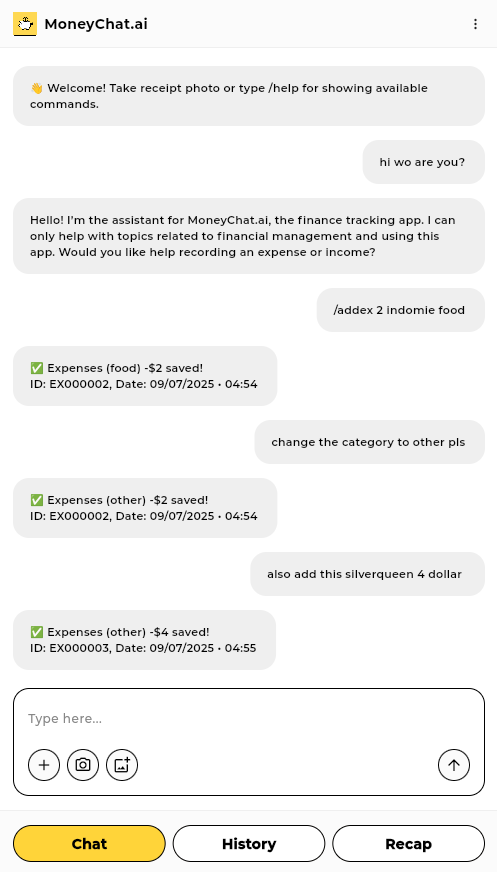
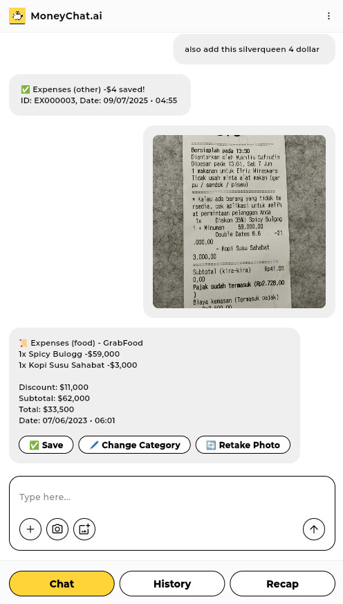
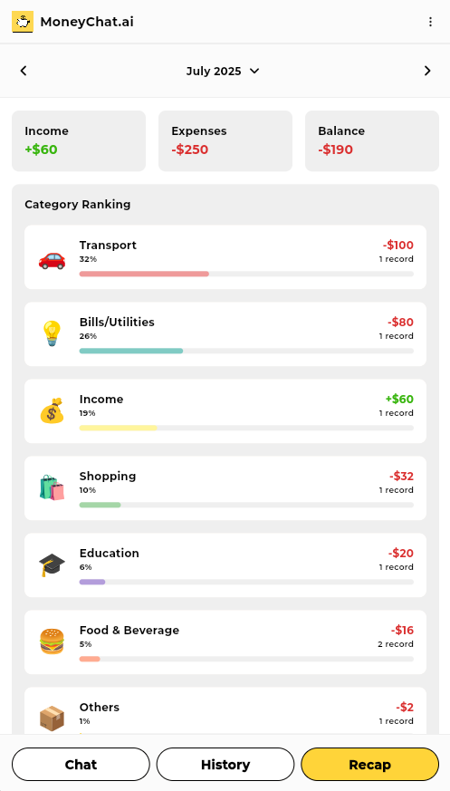

# MoneyChat.ai

MoneyChat.ai is an intelligent, chat-based personal finance tracker designed to help you stay on top of your money effortlessly.

Built with simplicity in mind, users can interact with the app just like chatting with a personal assistant. Add expenses, record income, and view monthly summaries — all through intuitive text commands.


Try out **MoneyChat.ai** here: [https://money-chat-ai.web.app/](https://money-chat-ai.web.app/)

### Features

- Record **expenses** and **income** with natural language or simple quick commands  
- Easily record your expenses by taking photo of your receipt
- Get **monthly recaps** of your financial activity  
- Focused only on personal finance — no distractions

### Example Quick Commands

```
/addex 10000 indomie food
/addin 150000 salary
/edit ex000001 amount 30000
/del ex000001
/recap 01 2025
/help
```

### Screenshoots

<p align="left">
    
    
    
    
</p>

## Table of Contents

- [Prerequisites](#prerequisites)
- [Flutter Setup](#flutter-setup)
- [Firebase Setup](#firebase-setup)
- [Firebase Cloud Functions Setup](#firebase-cloud-functions-setup)
- [Configuration Setup](#configuration-setup)
- [Building and Deployment](#building-and-deployment)

## Prerequisites

Before getting started, ensure you have the following installed on your system:

- **Google Chrome** - Required for Flutter web development
- **Node.js** (v16 or later) - Required for Firebase CLI and Cloud Functions
- **npm** or **yarn** - Package manager for Node.js
- **Google Account** - For Firebase console access

## Flutter Setup

### 1. Install Flutter SDK

#### Windows
1. Download the Flutter SDK from [flutter.dev](https://flutter.dev/docs/get-started/install/windows)
2. Extract the zip file to `C:\src\flutter`
3. Add `C:\src\flutter\bin` to your system PATH

#### macOS
```bash
# Using Homebrew
brew install flutter

# Or download manually from flutter.dev and add to PATH
export PATH="$PATH:`pwd`/flutter/bin"
```

#### Linux
```bash
# Download Flutter SDK
wget https://storage.googleapis.com/flutter_infra_release/releases/stable/linux/flutter_linux_3.16.0-stable.tar.xz
tar xf flutter_linux_3.16.0-stable.tar.xz

# Add to PATH
export PATH="$PATH:`pwd`/flutter/bin"
```

### 2. Verify Flutter Installation

```bash
flutter doctor
```

This command checks your environment and displays a report of Flutter installation status.

### 3. Enable Web Support

```bash
flutter config --enable-web
```

### 4. Install Project Dependencies

```bash
flutter pub get
```

## Firebase Setup

### 1. Install Firebase CLI

```bash
npm install -g firebase-tools
```

### 2. Login to Firebase

```bash
firebase login
```

This will open a browser window for Google authentication.

### 3. Install FlutterFire CLI
```bash
dart pub global activate flutterfire_cli
```

### 4. Configure Firebase
```bash
flutterfire configure
```

## Firebase Cloud Functions Setup

### 1. Navigate to Functions Directory

```bash
cd functions
```

### 2. Install Dependencies

If using JavaScript:
```bash
npm install
```

If using TypeScript:
```bash
npm install
npm install -g typescript
```

### 3. Set Environment Variables

Create `.env` file in functions directory:
```env
OPENAI_API_KEY=your_open_ai_api_key_here
```

## Configuration Setup

### 1. Create `config` Collection in Firestore


- `extractImagePrompt`: Extracts text from a receipt image. Sample: [extract_image_prompt.txt](prompts/extract_image_prompt.txt)
- `extractReceiptPrompt`: Extracts and parses receipt text into JSON to be processed by the app. Sample: [extract_receipt_prompt.txt](prompts/extract_receipt_prompt.txt)
- `mainPrompt`: Initializes the chat for interacting with the AI and handling natural language commands. Sample  [main_prompt.txt](prompts/main_prompt.txt)
- `maxTokens`: Maximum number of tokens generated per response
- `model`: GPT model to be used
- `userMaxRequest`: Daily limit for AI invocation requests per user

### 2. Add Firestore indexes


### 3. Update Security Rules

#### Firestore

```
rules_version = '2';

service cloud.firestore {
  match /databases/{database}/documents {
    match /{document=**} {
      allow read, write: if request.auth != null;
    }
  }
}
```

#### Storage

```
rules_version = '2';

// Craft rules based on data in your Firestore database
// allow write: if firestore.get(
//    /databases/(default)/documents/users/$(request.auth.uid)).data.isAdmin;
service firebase.storage {
  match /b/{bucket}/o {
    match /{allPaths=**} {
      allow read, write: if request.auth != null;
    }
  }
}
```

### 4. Cloud Run Authentication Security

You may need to `Allow unauthenticated invocations` in your Google Cloud Console for your [Cloud Run](https://console.cloud.google.com/run/) service


### 5. Enable CORS for Cloud Storage Bucket

You need to enable CORS to be able to view cloud network images in Flutter web; [How to enable CORS](https://codingwitht.com/how-to-view-cloud-images-in-flutter-web-enable-cors/)

## Building and Deployment

### 1. Deploy Cloud Functions

```bash
firebase deploy --only functions
```

### 2. Set Environment Variables

Create `.env` file in root directory:
```env
WEB_CLIENT_ID=xxxxxxxx.apps.googleusercontent.com
CLOUD_FUNCTIONS_URL=https://chatwithopenai-xxxxxxxx-uc.a.run.app
```

Note: If deploying to web server, ensure that the config file is uploaded and not ignored. (Whitelist the config file on the server, or name the config file without a leading `.`)

### 2. Build Flutter Web App

```bash
flutter build web --release
```

### 3. Deploy to Firebase Hosting

```bash
# Deploy web app
firebase deploy --only hosting
```

### 4. Deploy Everything

```bash
# Deploy both hosting and functions
firebase deploy
```

### 5. View Deployment

After successful deployment:
- **Web App**: `https://your-project-id.web.app`
- **Functions**: Check Firebase Console > Functions tab

## Additional Resources

- [Flutter Documentation](https://flutter.dev/docs)
- [Firebase Documentation](https://firebase.google.com/docs)
- [FlutterFire Documentation](https://firebase.flutter.dev/)
- [Firebase CLI Reference](https://firebase.google.com/docs/cli)

## Project File Structure

```
money_chat_ai/
├── assets/                         # Project assets (images, fonts, etc)
├── build/
│   └── web                         # Project build output files
├── functions/                      # Project Cloud Functions
│   └── index.js                    # Project Cloud Functions script
├── lib/                            # Project frontend source code
│   ├── app/            
│   │   ├── routes/                 # App routes configuration
│   │   ├── services/            
│   │   │   ├── auth/               # Authentication service       
│   │   │   ├── export/             # Export CSV service       
│   │   │   ├── firebase_storage/   # Firebase Storage client service             
│   │   │   └── open_ai/            # OpenAI client service       
│   │   ├── theme/                  # App theme, colors, text styles, etc
│   │   └── utilities/              # App utilities
│   ├── core/                       # Abstractions classess
│   ├── data/                           
│   │   ├── datasources/            # App datasources (firestore)
│   │   └── models/                 # Data models
│   ├── presentation/                           
│   │   ├── screens/                # App UI and controllers
│   │   └── widgets/                # App widgets
│   ├── firebase_options.dart       # Firebase config (auto-generated by firebase CLI)                           
│   └── main.dart                   # App main.dart file                       
└── README.md                       # Detailed instruction for the project
```

## License

This project is licensed under the [MIT License](LICENSE) - see the LICENSE file for details.